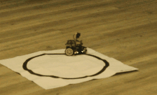

# Codes sources de la conférence : Optimiser son code sur µControleur

Conférence présentée par [Nao974] pour [Robotic974] chez [EPITECH Réunion] le 25/03/2022 en présence des étudiants de 1ere à 3eme année.

Ce dépôt reprend les grandes lignes de la conférence et les différents codes sources présentés.


## Introduction

Les MCU (Micro Controller Unit) sont principalement utilisés dans les systèmes autonomes. Dans la suite de cette présentation, nous simplifierons un système embarqué comme un système autonome mais en déplacement.

Cela implique des contraintes physiques différentes en fonction du système :
- Taille
- Poids
- Energie
- Robustesse
- Etc...

 Mais également des contraintes techniques :
 - Sureté de fonctionnement
 - Sécurité des données
 - Et des contraintes très fortes sur :
   - La taille Mémoire
   - La Vitesse de traitement
   - La Réactivité du système

Par exemple le MCU Atmel 328P de la carte Arduino est cadencé à 16Mhz et n'a que 2Ko de RAM.

 Afin d'imager la contrainte de Réactivité, prenons l'exemple d'un véhicule autonome avec le châssis Maqueen et une carte Micro:bit.

Nous le programmons dans un 1er temps avec un code simple sur MakeCode, en fonction de 2 capteurs infra-rouge placés dessous à l'avant, nous commandons les moteurs afin de suivre une piste noire : 

<p >
    
</p>

**Le véhicule autonome suit la route sans aucun problème :**

<p>
    
</p>

Nous rajoutons maintenant la lecture de distance d'un objet par le capteur ultrason, si un obstacle est devant à moins de 10cm alors le véhicule s'arrête, sinon il continu à suivre la piste :

<p>
    
</p>

**Le véhicule NE SUIT PLUS LA ROUTE :**
<p>
    
</p>

### Pourquoi ?

Les librairies standards utilisent une fonction bloquante de type PulseIn() afin de mesurer le temps écoulé entre l'émission des trames ultra-son et leurs retours une fois qu'elles ont rebondi sur un éventuel obstacle.

Ces capteurs peuvent en moyenne mesurer une distance max de 3 mètres, la vitesse du son étend de 347 m/s (à 25°), le MCU pourra donc être bloqué peandant 173 ms (sans obstacle devant) à chaque lecture de distance. 

*Cela est suffisant pour laisser dévier notre véhicule autonome en dehors de la route.*

***Il est donc important de faire la chasse aux fonctions bloquantes !!!***

Ressources additionnelles : 
- Mesure de distance par interruption : https://github.com/Robotic974/atmega328p-registers-and-interrupts
- Mise en œuvre  de 2x capteurs Ultra-son : https://youtu.be/Ve35dOHQbLI

___

## Notre projet de démonstration

### K2000

<p>  </p>

Ce qui caractérise ce véhicule autonome est ..... le jeux de lumière à l'avant !!!

**Notre  Objectif :**

Ecrire le code d'un chenillard avec 8 Leds. Ce code devra être léger et ne devra pas bloquer les autres fonctions de notre véhicule autonome.

Afin de simplifier le code, l'animation ne se fera que dans un sens (pas d'aller-retour).

**Schéma de Câblage**

<p>  </p>

Aucune difficulté particulière dans le câblage, chaque LED étend allumée l'une après l'autre, nous pouvons prendre le 5V directement à chaque broche du MCU. 

**Outil de Développement**

Afin de développer en langage C, compiler et transférer nos prochains codes sources sur notre carte MCU, nous utiliserons l'IDE VSCode avec l'extension [PlatformIO] .

**Codes Sources**

L'ensemble des codes sources décrits ci-après se trouvent dans le dossier [./src] de ce même dépôt.

___

## 01_BASIC_BOUCLE_FOR

[Fichier source](./src/01_Basic_Boucle-For.cpp)

Rien de compliqué pour commencer, 
- Une boucle `for` dans le `setup()` afin d'initialiser les broches du MCU en `Sortie` où sont branchées les LEDs.

- Puis dans la boucle principale, une autre boucle `for` : 
   - Nous allumons une LED, 
   - Nous attendons 75ms afin que note œil puisse capter la lumière
   - Nous éteignons la LED
   - La boucle `for` passe à la LED suivante 
- Une fois la dernière LED traitée, nous sortons de la boucle `for`
- La boucle principale relance une nouvelle boucle `for`

*Le code semble propre, fonctionnel, correspondre aux différents tutoriels que nous pouvons trouver sur internet, mais ...*

### **Quelques Règles de déclaration**

### Type des variables

La taille mémoire minimale allouable est 1 octet, donc déclarer un `boolean` est trompeur car en mémoire la variable ne prendra pas 1 bit mais 8 bits (1 octet).

Les différents types d'entier `int` ne sont pas parlant sur leur taille réelle en mémoire, de plus, en fonction du µControleur, il ne prendra pas forcément la même taille en mémoire :

<p>  </p>

Il faut donc privilégier les types décrivant dans leur nom, le nombre de bits utilisés :

- `int8_t`   au lieu du `char`
- `uint8_t`  au lieu du `byte` (char non signé)
- `int16_t`  au lieu du `int`
- `uint32_t` ... 

Nous voyons tout de suite la place utilisée en mémoire. 

### Déclaration des constantes

Il convient de ne pas utiliser  `#define` car le type de la constante n'est pas défini.

Privilégier la déclaration :
```java
const uint8_t NB_LED = 8;
```  

### Variable Globale

Notre code est un petit exemple, les variables globales déclarées sont utilisées dans le `setup()` et le `loop()`, nous pouvons donc les laisser en globale mais il convient de bien comprendre le fonctionnement de la mémoire : https://quai-lab.com/arduino-ses-memoires


<p><font color="red"> <u> <h1>LE GROS PROBLEME</h1> </u> </font></p>

L'utilisation de la fonction :
```cpp
delay(75);
```
C'est une fonction **BLOQUANTE !!!**, cela va bloquer toutes les autres fonctions pendant   8 * 75 ms = 600 ms à chaque boucle, notre véhicule autonome ira droit dans le mur... le code 02 va résoudre ce problème.
___

## 02_MILLIS

[Fichier source](./src/02_Millis.cpp)

la fonction `millis()` retourne le nombre de millisecondes écoulées depuis le démarrage/reset de la carte, il suffit de le comparer avec celui de notre derniere action sur le chenillard, si l'intervalle est >75ms alors nous passons à la LED suivante, nous remplaçons donc notre fonction bloquante par une condition.

C'est beaucoup mieux,

- Plus de fonction bloquante 
- Code portable sur différents MPU

*Mais nous pouvons l'optimiser afin de prendre beaucoup moins de cycle d'horloge pour notre chenillard.*

___

## 03_MILLIS+PORTD

[Fichier source](./src/03_Millis+PortD.cpp)

**Attention**, nous entamons notre descente au cœur  du MCU, le code va devenir spécialisé pour notre µcontroleur Atmel 328P, et ne sera donc plus portable avec d'autres cartes. Nous allons également nous éloigner du framework `Arduino`.

Vous aurez besoin pour cela des documents suivants :

- Le schéma [PINOUT] de la carte Arduino Uno 
- La DataSheet du µControleur [Atmel 328P]


### Le PortD
Les différentes broches digitales du 328P sont regroupées dans des `PORT`, pilotés par des registres.

Notre montage utilise les broches 0 à 7, ce n'est pas un hasard car celles-ci sont toutes rattachées au PORT D. C'est le seul port de l'Arduino UNO regroupant 8 broches (voir le schéma [PINOUT]).

*Par contre les broches 0 et 1 sont également branchées en interne de la carte sur le port série. Il convient donc à chaque téléversement de votre programme de débrancher ces broches de votre montage.*

Nous allons dans 1er temps initialiser ce PORT digital en `Sortie` grâce au registre DDR :

```cpp
DDRD  = B11111111; // Paramétrage des broches du port D en mode OUTPUT
```
Cela remplace la boucle `for` dans le `setup();`

Le registre PORTD permet d'appliquer la valeur 0 (0V) ou 1 (5V) à l'ensemble des broches en 1 seule instruction :
```cpp
PORTD = B00000000; // On éteint toutes les Leds
```

Il nous reste plus qu'à modifier notre ancien code afin de remplacer la fonction `digitalWrite()` par l'affectation de ce registre avec un décalage à gauche pour chaque changement de LED :
```cpp
PORTD = B00000001  << led++; 
led %=  NB_LED; // Permet de repasser de la Led 7++ à la Led 0
```

L'affectation direct d'un PORT est 6 à 8 fois plus rapide que la fonction `digitalWrite()`, sachant que nous affectons directement les 8 broches en une seule opération, je vous laisse calculer le temps gagné.

Je vous laisse découvrir ce qui se cache derrière la fonction [digitalWrite()] afin de mieux comprendre sa lenteur.
___

## 04_PORTD+TIMER

[Fichier source](./src/04_PortD%2BTIMER.cpp) 

C'est super, notre code est 40 fois plus rapide qu'au début, sans fonction bloquante.... Mais que se passera-t-il si mes différentes fonctions de ma boucle principale (lecture des capteurs, machine à état, etc...) durent plus 75 ms...
Vous pouvez faire le test en rajoutant un `delay(1500);` en fin du `loop()` dans le précèdent exercice.

Mon chenillard super fluide a pris un sacré coup dans l'aile, l'animation rame...

Bon là, va falloir s'accrocher est commencer par bien comprendre comment fonctionne un TIMER en travaillant les tutoriels I à III : https://www.locoduino.org/spip.php?article84

OK, je suis d'accord ce n’est pas simple, mais je vous conseille de créer une calculette avec votre tableur préféré afin de trouver le bon prédiviseur, la valeur de débordement, et nombre de Tac pour votre variable *compteurTimer* .

Donc, vous l'aurez compris, un TIMER est un compteur que nous allons paramétrer afin de diviser la vitesse de l'horloge jusqu'a avoir un tic toutes les 75ms.
A ce moment le TIMER lèvera une interruption de débordement et le µControleur arrêtera sa boucle principale afin d'exécuter notre fonction `ISR(TIMER2_COMPA_vect)` comprenant l'affectation du PORTD vu précédemment.

Le code source est largement commenté mais pour bien comprendre le fonctionnement il convient de travailler les tutoriels cités plus haut.

A noter que les variables utilisées dans la routine d'interruption (ISR) doivent être déclarées avec le qualificatif `volatile` afin de prévenir le compilateur quelles peuvent être modifiée par un moyen extérieur au programme en cours (*par interruption donc*).

___

## En Conclusion

Voilà, nous avons maintenant un code très performant, sans fonction bloquante, dont le déclenchement n'est plus lié à la boucle principale.

Nous n'utilisons plus de fonctions *gourmandes* du framework Arduino, par contre ce code est maintenant spécifique à un seul micro contrôleur.

**Bon code à tous !**
___

## Organisation des codes sources

Chaque exercice proposé correspond à un programme Arduino indépendant des autres exercices. Néanmoins, pour ne pas avoir à gérer autant de projets PlatformIO qu'il y'a d'exercices, on peut s'arranger pour tous les faire coexister au sein d'un même projet. 

Chaque exercice est traité dans un fichier source portant l'extension `.cpp` et stocké dans le dossier `src`. Par défaut, PlatformIO se charge de compiler tous les fichiers sources qu'il trouve dans le dossier `src`, et notamment le traditionnel `main.cpp`. Aussi, pour modifier ce comportement, il existe une directive très pratique à insérer dans le fichier `platformio.ini` qui va nous permettre d'indiquer précisément ce qu'il faut compiler ou non. Par exemple, si l'on souhaite compiler le programme décrit dans le fichier `01_Basic_Boucle-For.cpp`, et uniquement celui-là, il suffira de le spécifier à l'aide de la directive `src_filter` de la manière suivante :

```ini
[env:uno]
platform   = atmelavr
board 	   = uno
framework  = arduino
src_filter = -<*> +<01_Basic_Boucle-For.cpp>
```

Ici on construit une liste de fichiers à compiler, en commençant par exclure tous les fichiers se trouvant dans le dossier `src` avec la balise `-<*>`, puis en insérant le seul fichier `01_Basic_Boucle-For.cpp` que l'on souhaite compiler avec la balise `+<01_Basic_Boucle-For.cpp>`.

Par conséquent, pour compiler un autre programme, vous devrez préciser le nom du fichier correspondant avec la balise appropriée. Chaque fichier solution est spécifique et indépendant des autres. Vous ne pouvez donc en compiler qu'un seul à la fois.

*Reportez-vous à la documentation officielle de PlatformIO pour plus de détails sur [la directive `src_filter`][src-filter].*

[EPITECH Réunion]: https://www.epitech.eu/fr/ecole-informatique-la-reunion
[Robotic974]:      https://www.facebook.com/robotic974
[Nao974]:          https://www.youtube.com/channel/UC9U0Txo279cyaHdZIZnFn_g

[Atmel 328P]:      https://ww1.microchip.com/downloads/en/DeviceDoc/Atmel-7810-Automotive-Microcontrollers-ATmega328P_Datasheet.pdf
[PINOUT]:          assets/pinout_328P.pdf
[digitalWrite()]:  https://garretlab.web.fc2.com/en/arduino/inside/hardware/arduino/avr/cores/arduino/wiring_digital.c/digitalWrite.html
[PlatformIO]:      https://platformio.org/?utm_source=platformio&utm_medium=piohome
[./src]:             src/
